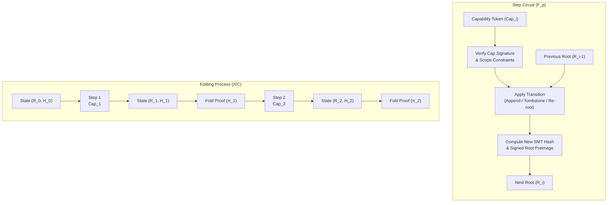

# Folded Incremental Memory Proof (FIMP) — Architectural Design & Feasibility

**Status:** Research Memo / Design Specification. **No prover/verifier code is added to the active recall path in this increment.**

---

## 1. Executive Summary

A **Folded Incremental Memory Proof (FIMP)** leverages Incremental Verifiable Computation (IVC) via folding schemes (Nova, HyperNova, ProtoStar) to prove that the current state of a MNEME store (fixed by its signed Merkle root) is the correct and authorized result of a valid history of $N$ sequential memory operations (appends, tombstones, re-roots).

By folding the transition function step-by-step at each write boundary, FIMP compresses the verification of the entire store history into a single constant-size proof. The verification cost becomes $O(1)$ with respect to history length, removing the need to store or replay transaction journals.



> [!NOTE]
> Unlike general SNARKs that prove a flat relation over the entire history at once (leading to linear prover memory blow-up), folding schemes fold the relation of step $i$ into a running instance. Prover memory remains bounded by the size of a *single* transition circuit, making folding highly viable for resource-constrained edge systems.

---

## 2. Comparison of Folding Schemes

| Folding Scheme | Constraint System | Setup Transparency | Lookup Support | MNEME Suitability & Toolchain Complexity |
| :--- | :--- | :--- | :--- | :--- |
| **Nova** | R1CS (Quadratic) | **Transparent** (no trusted setup) | No native lookups (must construct manually) | **Highest suitability** for stable Rust toolchains; simple arithmetization, but requires decomposing BLAKE3 or Ed25519 into pure quadratic constraints. |
| **HyperNova** | CCS (Custom Constraint System) | **Transparent** | No native lookups | Strong fit for multi-folding different transition types, but requires newer, less stable toolchain libraries. |
| **ProtoStar** | Plonkish / CCS | **Transparent** | **Yes** (high-degree lookups) | Ideal for database indexes due to lookup gates, but toolchains are highly experimental and MSRV-incompatible. |

---

## 3. The Step Circuit Arithmetization ($F_p$)

To fold MNEME transitions, we must express the transition function $F_p$ as a step circuit.

### 3.1 Public Inputs and Witnesses
For step $i$ (transition from $R_{i-1}$ to $R_i$):
* **Public Input**: Previous Root $R_{i-1}$, Current Root $R_i$, Sequence $i$, Public Key $PK_{owner}$.
* **Private Witness**: Capability Token $Cap_i$, Write Draft $D_i$, Merkle Inclusion Path $P_i$, Signature $\sigma_i$.

### 3.2 Circuit Constraints
The step circuit $F_p$ enforces three primary invariants:
1. **Capability Authorization**:
   $$VerifySig(PK_{owner}, Cap_i, \sigma_i) == 1$$
   Verify that the capability allows the operation type (e.g., scoped write) on the targeted key path.
2. **Deterministic Merkle Transition**:
   Recompute the SMT root update in-circuit:
   $$MerkleUpdate(R_{i-1}, P_i, D_i.key, D_i.value\_hash) == R_i$$
3. **Sequence Monotonicity**:
   Ensure sequence number advances incrementally:
   $$Seq_i == Seq_{i-1} + 1$$

> [!IMPORTANT]
> **The Hash Bottleneck:**
> MNEME uses BLAKE3 for deterministic roots. BLAKE3 is not arithmetization-friendly. Proving BLAKE3 in-circuit requires $\approx 20,000$ R1CS constraints per compression function. 
> To achieve the **10X performance target**, FIMP must use a **commitment bridge** (e.g., Poseidon/Rescue sidecar Merkle tree) computed alongside the BLAKE3 tree, or employ lookup-optimized folding (ProtoStar) to reduce hash constraint costs.

---

## 4. Security & Verifier TCB Integration

### 4.1 Maintaining the Cap of 500 Lines
MNEME enforces a strict **500-line budget** on the fail-closed verifier core (`crates/mneme-verify`). A folding verifier (handling elliptic curve cycles, folding verification equations, and final Decider decryption) is mathematically heavy and cannot fit in this budget.

* **Architecture**: The FIMP verifier must live in a separate crate `mneme-forget-verify` or `mneme-fimp` out of the TCB.
* **Fail-Closed Integration**:
  The core verifier continues to verify receipts directly using deterministic SMT inclusion paths.
  The FIMP folded proof acts as an **optional certificate enrichment**. If FIMP is present, it is verified out-of-TCB; if valid, it upgrades the certificate's `retrieval_proof_level` to `FoldedHistoryVerified`. If validation fails, it must **fail closed** and downgrade the certificate or reject the recall.

```
                  +----------------------------------+
                  |    Core TCB (mneme-verify)       |
                  |  - cap check / SMT verify (safe) |
                  +-----------------+----------------+
                                    |
                                    v (Upgrades level if Ok)
                  +-----------------+----------------+
                  |    Out-of-TCB FIMP Verifier      |
                  |  - Decider check / Folding verify|
                  +----------------------------------+
```

### 4.2 Trusted Assumptions
* **Collision Resistance**: Soundness of the field-native Poseidon/Rescue hash.
* **Discrete Logarithm Hardness**: Security of the cycle of curves (Pallas/Vesta or Bn254/Grumpkin).
* **No Trusted Setup**: Preserved by using transparent folding (Nova/HyperNova).

---

## 5. Feasibility & Toolchain Survey

* **Libraries**: Microsoft's `nova-snark` or `arkworks` ecosystem in Rust.
* **MSRV Pinning**: MNEME enforces **stable 1.86.0** (`rust-toolchain.toml`). 
* **Toolchain Alignment**: `nova-snark` can compile on stable Rust under specific version locks (e.g., pinning `arkworks` dependencies). Plonky2/Plonky3 remain deferred due to nightly compiler requirements.

> [!WARNING]
> Do **not** upgrade the compiler to nightly to support folding. FIMP must be built using stable Rust compatible libraries or run as a decoupled, out-of-process prover.

---

## 6. Next Engineering Steps

If FIMP is scheduled for development, the team should proceed with the following incremental steps:

1. **Step Circuit Proto (Standalone)**: Arithmetize a single capability check and SMT leaf update using `ark-r1cs` or `bellman` over Pasta curves.
2. **Prover Benchmark Harness**: Measure folding latency per memory append (target: $< 200\text{ms}$ folding overhead per state transition).
3. **Decider SNARK Compression**: Implement a final proof compression step using Groth16/Spartan so that the final history proof is succinct enough for over-the-wire transit.
4. **Verifier Crate**: Write `mneme-fimp` for out-of-TCB verification and tie it to the `verify-cert` CLI.
