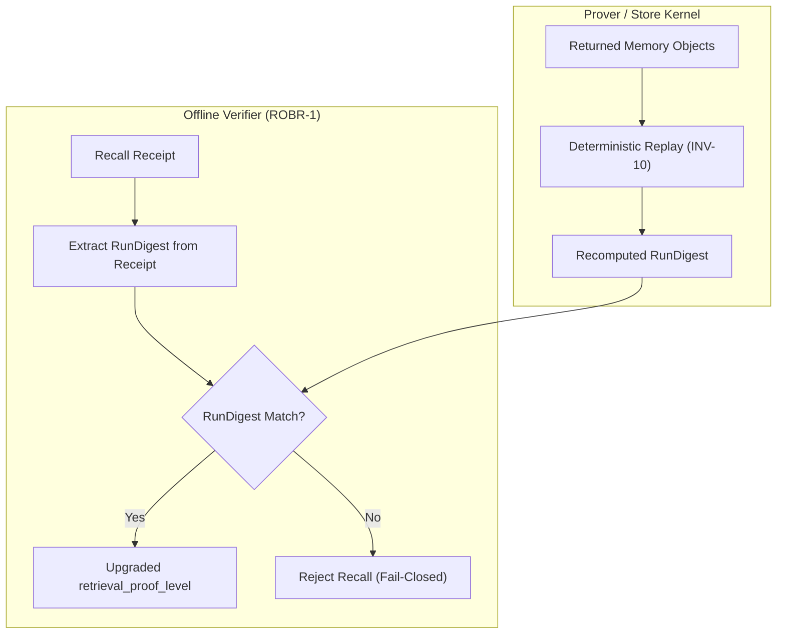
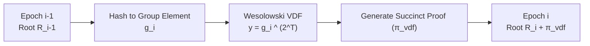

# Work Order — ROBR-1 & H3-VDF Anchoring Design Spec

**Status:** Active Design Specification & Implementation Plan. **No active recall code is modified in this step.**

---

## 1. Introduction & Objectives

This work order outlines the design and implementation tasks for two critical security and performance moats:
1. **ROBR-1 (Receipt-Object Binding Relation - Level 1)**: Direct cryptographic binding between recall receipts and deterministic object bytes via software-only replay. This builds on our proven cross-host bit-identical determinism and does not require TEE hardware.
2. **H3-VDF (VDF Heartbeat Time Anchoring)**: Integration of a sequential Verifiable Delay Function (VDF) into the checkpoint log to prevent the store operator (who holds the Ed25519 signing key) from backdating history.

---

## 2. ROBR-1: Software-Only Receipt-Object Binding

**Concept**: Proves that the memory objects returned from a recall query match the exact deterministic execution trace that produced the signed checkpoint root.

### 2.1 Cryptographic Equation
Let `V = {o_1, ..., o_k}` be the returned objects for query `q` and procedure `P`.
The verifier recomputes the deterministic hash of the objects' content-addressed digests sorted canonically:
$$\text{RunDigest} = \text{BLAKE3}\left(\text{Sort}\left(\text{H}(o_1), \dots, \text{H}(o_k)\right)\right)$$
If $\text{RunDigest}_{\text{recomputed}} \neq \text{RunDigest}_{\text{receipt}}$, the verifier rejects the read.

### 2.2 Trust Label & Honesty Boundary
> [!IMPORTANT]
> **Honesty Label (ROBR-1)**:
> *"Replay-verified (no TEE) proves that the retrieved objects match the exact deterministic trace signed by the operator, but does NOT prove that the computation was run inside attested hardware (which requires ROBR-4 TEE attestation)."*

---

## 3. H3-VDF: Operator-Resistant Time Anchoring

**Concept**: The operator can re-sign a modified history, but they cannot "backdate" it because each epoch is chained via a sequential squaring VDF that requires a minimum elapsed physical time to compute.

### 3.1 Cryptographic primitives
1. **Mathematical Base**: Wesolowski or Pietrzak VDF over an RSA group of unknown order (class group of imaginary quadratic fields to avoid a trusted setup).
2. **VDF Equation**:
   Given input group element $x \in G$ derived from Root $R_{i-1}$, the prover computes:
   $$y = x^{2^T} \pmod N$$
   where $T$ represents the difficulty parameter (tuning the sequential time delay).
3. **Verification**: Verification of the Wesolowski proof takes $O(1)$ scalar multiplications, allowing cheap offline validation.

### 3.2 Time Anchor Binding
To bind relative sequential work to absolute wall-clock time, the operator must periodically publish the VDF-chained epoch hashes to an external immutable anchor:
* **Drand**: Threshold BLS random beacons.
* **CT**: Certificate Transparency logs.
* **Public Blockchain / MTL**: Public ledger anchor.

### 3.3 Trust Label & Honesty Boundary
> [!WARNING]
> **Honesty Label (H3-VDF)**:
> *"VDF time anchoring proves that a minimum amount of sequential CPU/ASIC work has elapsed between epoch checkpoints, but does NOT prove absolute wall-clock time unless bound to a verified external trust anchor."*

---

## 4. Work Order Tasks & Implementation Matrix

### 4.1 ROBR-1 Implementation Steps
- [ ] **Task 1: Crate & Trait Wiring**: Add `mneme-robr` crate. Define `verify_replay_binding` trait.
- [ ] **Task 2: CLI Integration**: Extend `mneme verify-cert` to perform offline ROBR-1 verification if the receipt carries a `RunDigest` field.
- [ ] **Task 3: Failure Gate (Fail-Closed)**: Ensure that a mismatch in `RunDigest` during verification raises `MnemeError::RetrievalDominanceFailed` or `ZkProofInvalid`.

### 4.2 H3-VDF Implementation Steps
- [ ] **Task 4: VDF dependency**: Integrate a stable, transparent class-group VDF library (e.g. `chiavdf` Rust bindings or custom class-group arithmetic).
- [ ] **Task 5: Chained Checkpoint Log**: Update `mneme-root` to chain checkpoints:
  $$\text{Checkpoint}_i = \text{Sign}(R_i \mathbin{\Vert} \text{Checkpoint}_{i-1} \mathbin{\Vert} \pi_{\text{vdf}})$$
- [ ] **Task 6: External Anchor Sync**: Implement a sync client to fetch and verify drand beacon signatures bound to the epoch headers.
